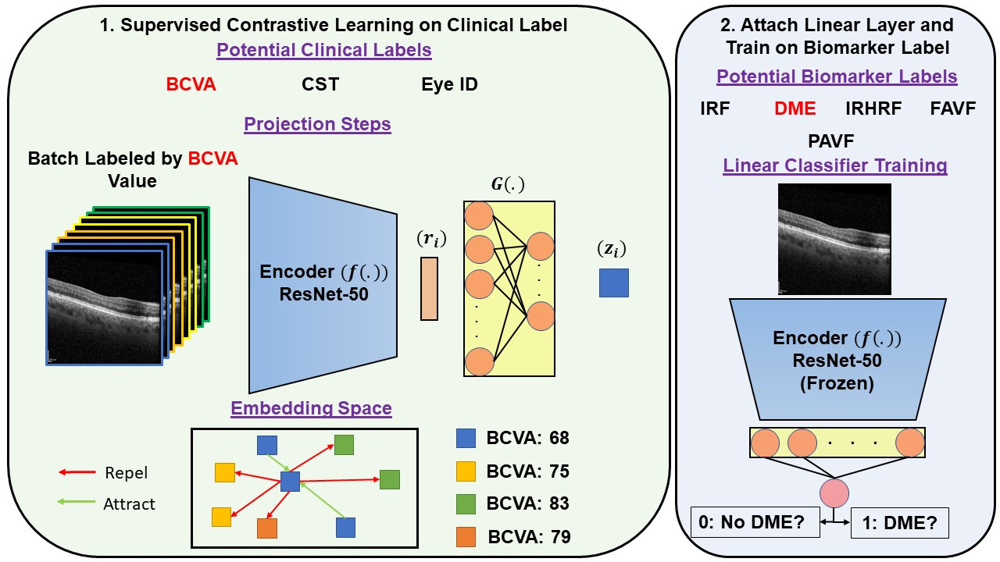

# Clincally Labeled Contrastive Learning for OCT Biomarker Classification

***

This work was done in the [Omni Lab for Intelligent Visual Engineering and Science (OLIVES) @ Georgia Tech](https://ghassanalregib.info/). 
It has recently been accepted for publication in the IEEE Journal for Biomedical and Health Informatics!!
Feel free to check our lab's [Website](https://ghassanalregib.info/publications) 
and [GitHub](https://github.com/olivesgatech) for other interesting work!!!

***

## Citation

K. Kokilepersaud, S. Trejo Corona, M. Prabhushankar, G. AlRegib, C. Wykoff, 
"Clinically Labeled Contrastive Learning for OCT Biomarker Classification," 
in IEEE Journal of Biomedical and Health Informatics, 2023, May. 15 2023.

>@article{kokilepersaud2023clinically,
  title={Clinically Labeled Contrastive Learning for OCT Biomarker Classification},
  author={Kokilepersaud, Kiran and Corona, Stephanie Trejo and Prabhushankar, Mohit and AlRegib, Ghassan and Wykoff, Charles},
  journal={IEEE Journal of Biomedical and Health Informatics},
  year={2023},
  publisher={IEEE}
}

## Abstract
This paper presents a novel positive and negative set selection
strategy for contrastive learning of medical images based on labels
that can be extracted from clinical data. In the medical field, there
exists a variety of labels for data that serve different purposes
at different stages of a diagnostic and treatment process. Clinical
labels and biomarker labels are two examples. In general, clinical
labels are easier to obtain in larger quantities because they are
regularly collected during routine clinical care, while biomarker
labels require expert analysis and interpretation to obtain. Within
the field of ophthalmology, previous work has shown that clinical
values exhibit correlations with biomarker structures that manifest
within optical coherence tomography (OCT) scans. We exploit this
relationship by using the clinical data as pseudo-labels for our
data without biomarker labels in order to choose positive and
negative instances for training a backbone network with a supervised contrastive loss. 
In this way, a backbone network learns a
representation space that aligns with the clinical data distribution
available. Afterward, we fine-tune the network trained in this
manner with the smaller amount of biomarker labeled data with
a cross-entropy loss in order to classify these key indicators of
disease directly from OCT scans. We also expand on this concept
by proposing a method that uses a linear combination of clinical
contrastive losses. We benchmark our methods against state of
the art self-supervised methods in a novel setting with biomarkers
of varying granularity. We show performance improvements by as
much as 5% in total biomarker detection AUROC.

## Visual Abstract

## Data

The data for this work can be found at this 
[zenodo](https://doi.org/10.5281/zenodo.7105232) location, 
with the associated paper located [here](https://arxiv.org/abs/2209.11195).

Partitions of the data into training and test splits can be found in the directories
final_csvs_1, final_csvs_2, and final_csvs_3. The number indicates which split of patients is currently being used.

In a typical experiment, contrastive pre-training takes place on the data present in the file:

**./final_csvs_1/datasets_combined/prime_trex_compressed.csv**

Biomarker fine-tuning typicall takes place in the file:

**./final_csvs_1/biomarker_csv_files/complete_biomarker_training.csv**

Testing files are located in the folder:

**./final_csvs_1/test_biomarker_sets**

## Code Usage

1. Set the python path with: **export PYTHONPATH=$PYTHONPATH:$PWD**

2. Train the backbone network with the supervised contrastive loss using the parameters specified in config/config_supcon.py \
a) Specify number of clinical labels to train with --num_methods parameter \
b) Specify which clinical labels to train with --method1, --method2, etc. \
c) Specify which dataset to train within in the --dataset field \
d) An example of a script would be: \
python training_main/clinical_sup_contrast.py --dataset 'Prime_TREX_DME_Fixed' --num_methods 1 --method1 'bcva'

3. Train the appended linear using the parameters specified in config/config_linear.py \
a) Set the super flag to identify whether to use contrastively trained backbone (0), completely supervised (1), or fusion supervised (2). \
b) Set the multi flag to (1) in order to control whether multi-label classification is used and (0) otherwise. \
c) If not using multi-label classification, then set the biomarker flag to the biomarker of interest used in this study. \
d) Set the --dataset field. \
e) An example of this script would be: 
python training_main/main_linear.py --dataset 'Prime' --multi 0 --super 0 --ckpt 'path_to_checkpoint file' --biomarker 'fluid_irf'

### Acknowledgements

This work was done in collaboration with the [Retina Consultants of Texas](https://www.retinaconsultantstexas.com/).

This codebase utilized was partly constructed with code from the [Supervised Contrastive Learning](https://github.com/HobbitLong/SupContrast) Github.